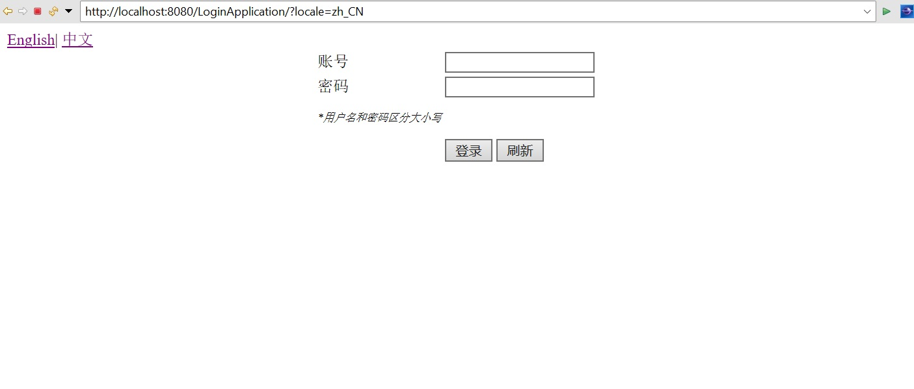
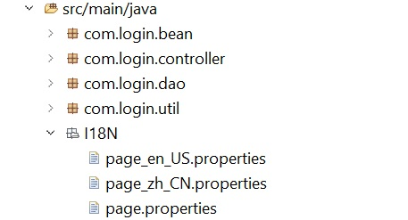

<h2 align="center">Problem Description</h2>
<h3 align="center">(Solution has supported EN and CN languages)</h3>
  

 

# Project Details

This project is done by following the MVC framework as follows:
1) Model: SQL Database using wamp server (version 5.7.40)
2) View: JSP 
3) Controller: Tomcat Apache (version 9.0)

The web application supports both english and chinese languages.

The whole project is coded in JAVA(Front-end/Back-end).
 
 
## SQL Database
  
   
  
- I have created a "users" table inside my login application with the follow entries as shown. There are 2 roles, User and Manager as per requirement.  
 

## View (login page)
  
  
 - This is the login page sbow in english languauge.
  
   
   
  
  
  
 - This is the login page shown in chinese language. 
  
 - User is able to toggle between the languages by clicking on the "English| 中文 " Hyperlink on the top left corner. 
   

## View (User Page)

  
  
 - This is the user page after a successful login shown in english language. 
   
   
  
  
  
 - This is the user page after a successful login shown in chinese language. 
   
  
  ## View (Manager Page)
  
  
  
 - This is the manager page after a successful login shown in english language. It also comes with a restricted page "Manager Special Page" only accessible by the       manager.
  
   
   
  
  
  
  - This is the manager page shown in chinese language. 
   
  
  ## View (Manager Restricted Page)
  
  
  
  - Upon clicking on the hyperlink (Manager Special Page) in the manager's home page, it will redirect the manager to this restricted page only accessible by the manager shown in english language. It also comes with a back button for the manager to return back to the manager's home page. 
 
  
  
 
   
  
  - This is the the restricted page shown in chinese language.
 
  
  

   

- If a user tries to enter this restricted page by entering the URL, a pop-up error message will be shown and immediately redirects him back to the login page.
- There are two types of session in this application, the "User" and "Manager". Any other sessions except the Manager's will not be allow to access this restricted page.

 

## View (Logout Page)

   

- A logout button is available at the home page and upon clicking, it will bring the user back to the login page with the message "You have logged out successfully" shown in red.

 

## Additional Infomation

   
  
 - To implement multi-lingual pages, I have created 3 properties files for each language, 'page.properties' contains the english elements by default, 'page_en_US.properties' containes the english elements and 'page_zh_CN.properties' contains the chinese elements. 
 - For 'page_zh_CN.properties', it has to be in unicode and the JSP content type has to be set to 'UTF-8' for all the JSP files.
 - Lastly, for the JSP to initialize the properties files I have used the JavaServer Pages Standard Tag Library (JSTL). It allows me to have a collection of custom tags to support the multi-languages in each pages.

